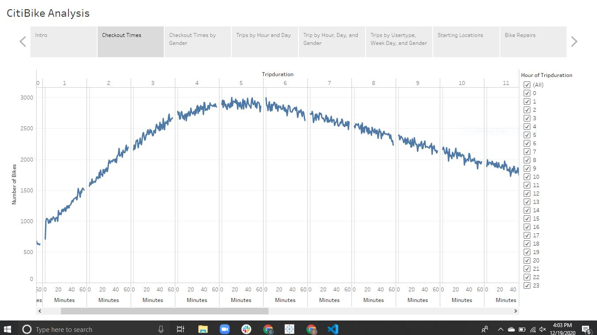
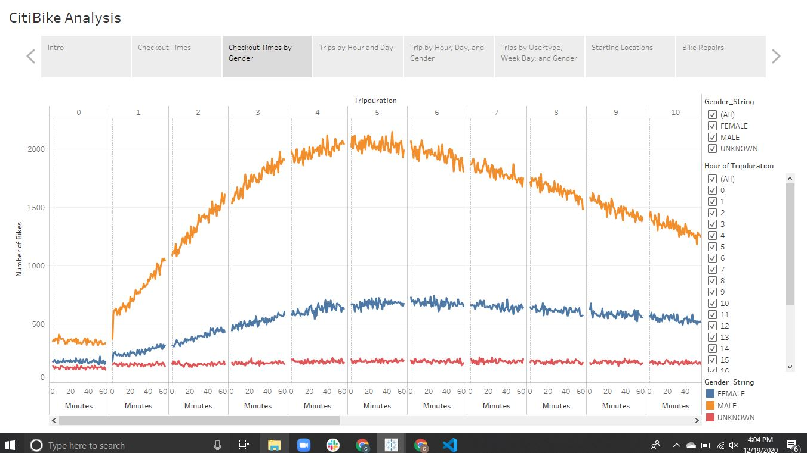
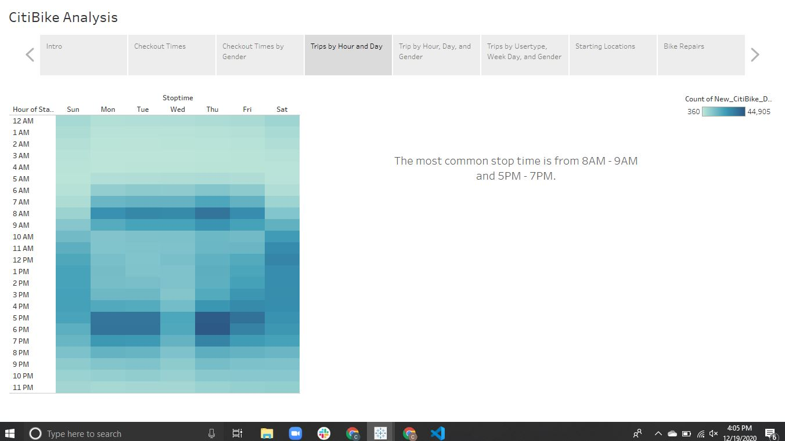
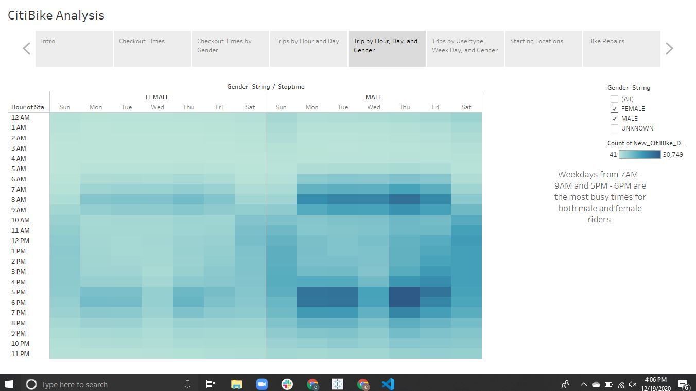
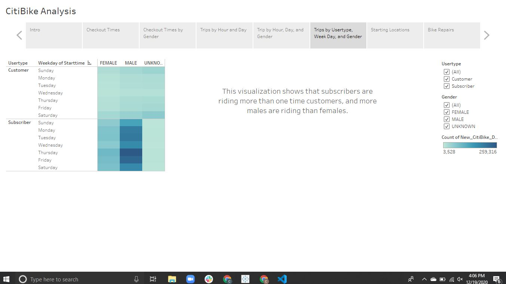
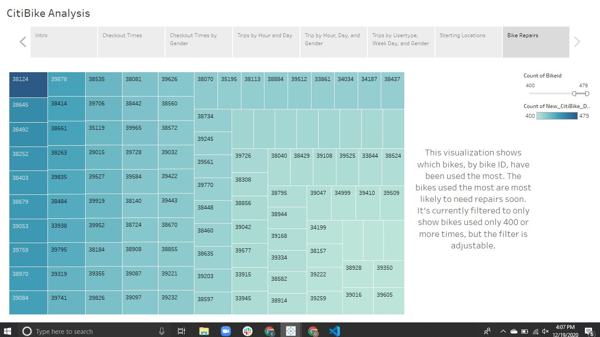

# CitiBike Analysis
### Module 14 with Tableau 

## Overview

In this module I do an analysis of publicly available CitiBike data from New York City to see if a bike-sharing company would be a good idea in Des Moines, Iowa. This business proposal considers pros and cons of the data shown from CitiBike in NYC, using Tableau to visualize the data. Pandas was used to properly format the data.

## Results

The first visualization in my Tableau story shows trip duration for each trip. This shows that a majority of rides are in the five hour range, as the visualization peaks in the fifth hour. 

 

The next visualization is similar to the first, but it's broken down by gender as well. This visualization shows that males are taking more rides than females and the unknown group. Trip duration still appears to peak in the fifth hour.

 

This next visualization shows trip by weekday and hour. The most common stop times are 8AM - 9AM and 5PM - 7PM from Monday to Friday. This implies a lot of people are using CitiBikes to commute to and from work. 

 

Here you can see trips by hour, weekday, and gender. This also implies that people are using CitiBikes to commute to and from work. It's clear from this visualization that men are taking more trips than women.

 

This view of the data breaks down trips by user type, weekday, and gender. The day of the week appears to be less relevant here, but this visual again enforces that more men use CitiBikes than females. 

 

This map shows the starting point of every CitiBike trip in NYC. Many people start around Central Park, which may be explained by a high volume of tourists, as well as high population density. 

 

Lastly, this visual shows which bikes may need repair in the near future. Each block in the visual is a bike, with the larger and darker blocks being the bikes that have been used the most times. It's important the keep track of the bikes' use so you can anticipate the cost and interruption in service when you need to make repairs. 

## Summary:

There are a few trends that stand out in these visualizations. The first is that men are using CitiBikes much more often than women. Second is that the most common use for CitiBikes is commuting to and from work. There are casual, mid day riders on the weekend, but most trips occuring during commuting hours. Lastly, many trips start near Central Park and close to many popular tourist spots. This may support heavy use from tourists in NYC. 

Another visualization I believe would be helpful is looking at starting points broken down by user type. If one time users start around Central Park this could imply that one time users are likely tourists.  

I'd also like to look at trips by user type, weekday, and hour. This would further clarify whether or not subscribers are often local commuters, and one time users are often tourists. If all the subscribers are using CitiBikes during commuting hours, you can guess that they are locals commuting to work.

Overall, I'm not sure that there's enough information to make a confident decision to start a bike sharing company in Des Moines. New York City and Des Moines are two very different cities, so New York City may not be the best comparison to make this decision. If commuters are the largest user group for CitiBikes then Des Moines may be a good choice. However, if tourists make up a large part of the users, Des Moines may struggle to find users.